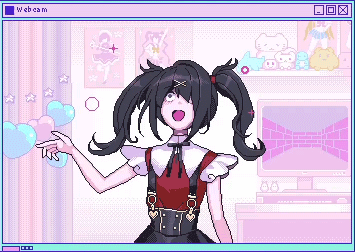
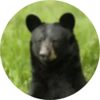

# Hiiiiiiiiii, I'm **Olivia** >w<
### ❤ Working on dumb things when I don't have to be smart ❤

 

- 🔭 I’m currently working on PushPals

- 🌱 I’m currently learning C, Haskell, Machine learning and Jupyter Notebook

- 🤝 I’m looking for help with my mental health :3

- 🐶 Arf!

- 🖥️ Using MacOS (mainly ^-^)

 
 
 
 
 

## "Skills" (⁄ ⁄•⁄ω⁄•⁄ ⁄)

  
   
   

## Socials OwO

  
   
   

## Friends U^ᴥ^U ♡

  

   
   

  <a href="https://x.com/Cutieanimator">
  <a href="https://github.com/Marcus543211">
  <a href="https://github.com/snadster">
  <a href="https://github.com/sofielofberg">
  <a href="https://github.com/DrFisk0">

 
 

   
   
   
   
   
   
   
   
   
   
  

