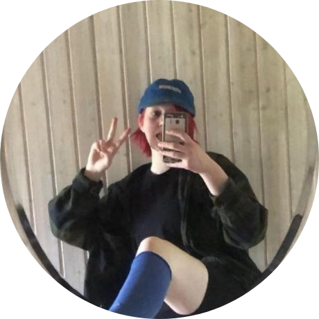

# Hiiiiiiiiii, I'm **Olivia** >w<
### ❤ Working on dumb things when I don't have to be smart ❤

 

- 👋 CS student with an interest in **web development**, **algorithms** and **home labbing**
- 🖥️ Using  and 
- 🌐 **Web Stack**:     
- 📊 **Data Science**:    
- 🛠️ **Other Skills**:    

 <!-- Badges from https://github.com/inttter/md-badges -->

 

## Friends ^-^ ♡

  
  

   
   

  <a href="https://x.com/Cutieanimator">
  <a href="https://github.com/Marcus543211">
  <a href="https://github.com/snadster">
  <a href="https://github.com/sofielofberg">
  <a href="https://github.com/DrFisk0">
  <a href="https://bsky.app/profile/gerewodezyakyry.bsky.social">
  <a href="https://www.jolenecoda.com/">
  <a href="https://www.youtube.com/@LadyVelvetASMR">

